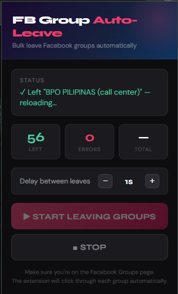

# 🧹 FB Group Sweeper

> A Chrome extension that automatically leaves all your Facebook groups in one click — no manual clicking required.


<!-- ☝️ Replace "screenshot.png" with your actual screenshot file after uploading it to the repo -->

---

## ✨ Features

- ✅ One-click to leave all Facebook groups automatically
- ⏱️ Configurable delay between each leave action
- 📊 Live counter showing groups left & errors
- 🔄 Auto-resumes after page reload
- 🛑 Stop anytime with a single click

---

## 📸 Screenshot

<!-- Upload your screenshot to the repo and update the filename below -->


---

## 🚀 Installation

1. Download or clone this repository
   ```
   git clone https://github.com/jm5155/fb-group-sweeper.git
   ```
2. Open Chrome and go to `chrome://extensions/`
3. Enable **Developer Mode** (top right toggle)
4. Click **Load unpacked**
5. Select the `fb-leave-groups-extension-fixed` folder

---

## 🛠️ How to Use

1. Go to [facebook.com/groups/joins](https://www.facebook.com/groups/joins/?nav_source=tab&ordering=viewer_added)
2. Click the **FB Group Sweeper** icon in your Chrome toolbar
3. Set your preferred delay (in seconds) between each leave
4. Click **Start** — sit back and let it run!
5. Click **Stop** anytime to pause

---

## ⚙️ Files

| File | Description |
|------|-------------|
| `manifest.json` | Chrome extension config |
| `content.js` | Main automation logic |
| `popup.html` | Extension popup UI |
| `popup.js` | Popup controls & messaging |
| `background.js` | Background service worker |

---

## ⚠️ Disclaimer

This extension is for personal use only. Use responsibly and in accordance with [Facebook's Terms of Service](https://www.facebook.com/terms.php). The author is not responsible for any account actions taken by Facebook.

---

## 📄 License

MIT License — free to use, modify, and share.

---

*Made by [jm5155](https://github.com/jm5155)*
